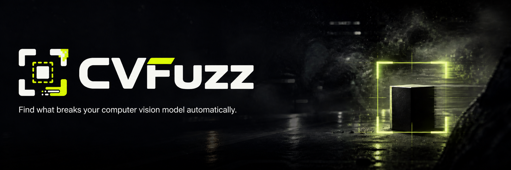
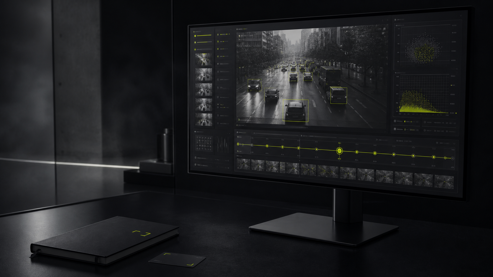

<p align="center">
  
</p>

<p align="center">
  <strong>Find the smallest realistic change that breaks your computer-vision model.</strong>
</p>

<p align="center">
  Local-first robustness testing for object detectors — from failure-boundary search to full-stream video evaluation.
</p>

<p align="center">
  <a href="https://baselhusam.github.io/CVFuzz/"></a>
  <a href="LICENSE"></a>
  <a href="backend/pyproject.toml"></a>
  <a href="frontend/package.json"></a>
</p>

<p align="center">
  <a href="#why-cvfuzz">Why CVFuzz</a> ·
  <a href="#quick-start">Quick start</a> ·
  <a href="#workflows">Workflows</a> ·
  <a href="#configuration">Configuration</a> ·
  <a href="#documentation">Documentation</a>
</p>

---

## Why CVFuzz

Production vision systems encounter degraded optics, motion, bad weather, compression, and
partial visibility. Standard accuracy reporting tells you *whether* a model is good; CVFuzz
helps reveal *where its robustness ends*.

For every baseline detection, CVFuzz applies controlled, configurable visual transformations
and detects the first severity that causes a meaningful prediction change. It can also evaluate
an entire video stream and produce synchronized, annotated evidence for every enabled
transformation.

> **Question CVFuzz is built to answer:** *At what motion-blur kernel, exposure loss, fog
> strength, or occlusion percentage does this specific object fail?*

| Built for | What you get |
| --- | --- |
| Model validation | Reproducible failure boundaries for individual baseline objects |
| Video robustness review | Original and transformed annotated MP4s with run-level metrics |
| Local experimentation | File-backed runs, JSONL data, and no database or remote service |
| Engineering workflows | YAML-defined transformations, deterministic seeds, and a CLI/API/UI stack |

<p align="center">
  
</p>

## Highlights

- **Two complementary testing modes.** Search for the smallest object-level failure boundary,
  or evaluate every frame of a complete video stream.
- **Nine realistic degradations.** Exposure, low-light noise, motion blur, defocus, JPEG
  compression, resolution degradation, fog, target-aware partial occlusion, and glare.
- **Detection-aware failure analysis.** Identify missed objects, confidence collapse, class
  changes, and localization drift using IoU-based matching.
- **Evidence you can inspect.** Persist source inputs, YAML configuration, manifests, metrics,
  event streams, frame results, failure images, and browser-playable annotated videos.
- **Reproducible by design.** Transformation sweeps and render settings live in versioned YAML;
  runs retain the configuration that produced them.
- **Local-first architecture.** No database, cloud dependency, or synthetic demo results. GPU
  acceleration is optional.

## Workflows

```text
                         ┌────────────────────────────────────┐
model + image/video ───► │ Boundary search (CLI)              │
                         │ Find the least-severe object break │
                         └────────────────────────────────────┘
                                        │
                                        ▼
                  manifests · JSONL results · summaries · failure images

model + video ──────────► render one complete video per transformation
                                        │
                                        ▼
                         evaluate original and augmented streams
                                        │
                                        ▼
                  annotated MP4s · metrics · events · persistent web run
```

### 1. Failure-boundary search

The `run` command uses baseline detections as metamorphic references when annotations are not
available. For each object and transformation variant, it walks the configured severity levels,
then numerically refines a boundary where the transform supports interpolation.

This mode accepts an image, image directory, or video and writes portable run artifacts under
the configured output directory (by default, `.cvfuzz/runs/`).

### 2. Full-stream video evaluation

The `video-run` command and local web application render one complete video for every enabled
augmentation, then evaluate the original and every transformed frame. The result is a single,
self-contained run with annotated MP4s, per-frame data, progress events, and aggregate metrics.

When ground-truth annotations are unavailable, a changed prediction indicates **model
instability**, not proof that the transformed prediction is objectively incorrect. Annotated
evaluation is planned as a future mode.

## Quick start

### Prerequisites

- Python **3.11**
- macOS or Linux
- An [Ultralytics](https://docs.ultralytics.com/) compatible detection model (the first
  supported adapter targets YOLO)
- Optional: a GPU-supported runtime for faster inference

```bash
git clone https://github.com/baselhusam/CVFuzz.git
cd CVFuzz/backend

python3.11 -m venv .venv
source .venv/bin/activate
python -m pip install -e '.[dev,yolo]'
```

Create a configuration, verify it, and inspect the transformations:

```bash
cvfuzz init-config cvfuzz.yaml
cvfuzz validate-config cvfuzz.yaml
cvfuzz transforms
```

Run a failure-boundary test:

```bash
cvfuzz run /path/to/yolo11n.pt /path/to/street.mp4 --config cvfuzz.yaml
cvfuzz inspect .cvfuzz/runs/<run-id>
```

Run full-stream evaluation instead:

```bash
cvfuzz video-run /path/to/yolo11n.pt /path/to/street.mp4 --config cvfuzz.yaml
cvfuzz inspect-video .cvfuzz/runs/<run-id>
```

## Web interface

CVFuzz includes a local Next.js interface for uploading a model and video, tracking a run, and
reviewing synchronized original and transformed videos side by side.

Start the API from the activated backend environment created in Quick start:

```bash
cvfuzz serve
```

Then, from the repository root in another terminal, start the frontend:

```bash
cd frontend
npm install
npm run dev
```

Open [`http://localhost:3010`](http://localhost:3010). The tracked defaults use
`http://127.0.0.1:8020` for the local API, and completed web runs are stored under
`backend/.cvfuzz/web-runs/`.

See the [frontend guide](frontend/README.md) for environment variables, supported upload
formats, API routes, and frontend quality checks.

## Configuration

Every transformation is configured through versioned YAML. A transform has one ordered
`search_parameter`; all other multi-value parameters create independent variants. The
`render_parameters` select the single representative variant used in a full-length output video.

```yaml
transforms:
  motion_blur:
    enabled: true
    search_parameter: kernel_size
    identity_value: 1
    render_parameters: {kernel_size: 11, angle_degrees: 45}
    parameters:
      kernel_size:
        values: [3, 5, 7, 9, 11, 15, 21]
      angle_degrees:
        values: [0, 45, 90]
```

Keep search values ordered from least to most severe. Parameters can use explicit values or an
inclusive numeric range:

```yaml
stops:
  range: {start: -0.5, stop: -3.0, step: -0.5}
```

Start with [the default profile](backend/configs/default.yaml), or use the compact
[smoke profile](backend/configs/smoke.yaml) for a smaller end-to-end run.

## Artifacts and architecture

Runs are deliberately self-contained and portable. CLI full-stream runs use the configured
`run.output_dir` (by default, `.cvfuzz/runs/`); web runs use `backend/.cvfuzz/web-runs/` by
default. A web run contains the uploaded inputs, generated videos, configuration, and
machine-readable evidence:

```text
.cvfuzz/web-runs/<run-id>/
├── inputs/        # Uploaded model and source video
├── artifacts/     # Browser-ready annotated original + transform MP4s
├── config.yaml    # Exact configuration used for the run
├── manifest.json  # Run identity and status
├── events.jsonl   # Progress event stream
├── baseline.jsonl # Original-frame reference detections
├── frames.jsonl   # Per-frame evaluation results
├── metrics.json   # Aggregate robustness metrics
└── artifacts.json # Artifact metadata
```

The system keeps model adapters, transformations, failure detection, search, execution, and
storage independent to make future adapters and interfaces straightforward to add.

## Documentation

- [Backend documentation](backend/README.md) — API, CLI details, full-stream behavior, and
  artifact layout.
- [Frontend documentation](frontend/README.md) — local UI setup, configuration, and API usage.
- [Self-hosting guide](docs/deployment.md) — Docker Compose deployment, persistent runs, and GPU
  setup.
- [Default YAML configuration](backend/configs/default.yaml) — all built-in transformation
  parameters and failure thresholds.
- [Project website](https://baselhusam.github.io/CVFuzz/) — public project overview.

## Development

From `backend/` with the virtual environment activated:

```bash
ruff check .
pytest
pytest --cov=cvfuzz --cov-report=term-missing
```

The test suite covers configuration validation, image transformations, failure classification,
boundary refinement, full-stream rendering, file persistence, multipart API runs, and HTTP byte
ranges for playable artifacts.

## Roadmap

- Ground-truth and annotated-dataset evaluation
- Combination and stochastic transformation search
- HTML reports and shareable failure cards
- Cross-model and cross-run comparison
- More model formats, tasks, and adapter implementations
- CI robustness policies and regression gates

## License

CVFuzz is released under the [MIT License](LICENSE). Ultralytics software and model weights have
their own licensing terms; review those terms before distributing a product that uses the
Ultralytics adapter.

Created by [Basel Husam](https://baselhusam.com).
