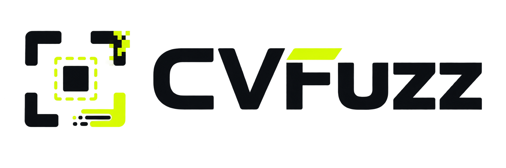

# CVFuzz Brand Guidelines

**Version 1.0 — August 2026**  
**Status:** Approved brand foundation. Product design-system decisions remain provisional until
they are documented separately.

**Professional visual edition and editable publication source:**
[`CVFuzz_Brand_Guidelines.html`](CVFuzz_Brand_Guidelines.html)

  

CVFuzz finds the smallest realistic change that destabilizes a computer-vision model. Its brand
should make rigorous failure analysis feel precise, understandable, and reproducible—not chaotic
or alarmist.

## 1. Brand idea

### Positioning

**Find what breaks your computer vision model automatically.**

CVFuzz is a local-first robustness testing platform for teams that need to understand not only
whether a model fails, but exactly where its failure boundary begins.

### Brand promise

CVFuzz turns model instability into a measurable, reproducible boundary.

### Personality

- **Precise:** show the parameter, threshold, object, and evidence.
- **Investigative:** probe methodically and remain curious about failure.
- **Calm:** report risk without exaggeration or fear-based language.
- **Transparent:** distinguish observed instability from proven model error.
- **Technical but approachable:** use domain language when it adds meaning, then explain it plainly.

### Creative principle

> Controlled distortion. Clear evidence.

The identity may express one deliberate break, offset, or transformation inside an otherwise
orderly system. Avoid decoration that makes CVFuzz look random, destructive, or security-focused.

## 2. Logo system

### Meaning

The symbol combines four ideas:

1. **Corner brackets** evoke a computer-vision detection region.
2. **The inner target** represents the object being evaluated.
3. **The displaced pixels and trailing edge** represent a controlled transformation.
4. **The signal-lime accent** marks the discovered failure boundary.

The wordmark is intentionally heavy and geometric, giving the experimental symbol a stable
counterweight.

### Approved logo assets

| Asset | Use | Format |
| --- | --- | --- |
| [`cvfuzz-logo-light.png`](../logos/cvfuzz-logo-light.png) | Primary horizontal lockup on white or very light neutral surfaces | Transparent PNG, 2172 × 724 px |
| [`cvfuzz-logo-dark.png`](../logos/cvfuzz-logo-dark.png) | Approved horizontal lockup for dark fields and dark photography | Transparent PNG, 2172 × 724 px |
| [`cvfuzz-symbol-light.svg`](../logos/cvfuzz-symbol-light.svg) and [`cvfuzz-symbol-light.png`](../logos/cvfuzz-symbol-light.png) | Compact symbol on white or very light neutral surfaces | SVG or transparent PNG, square |
| [`cvfuzz-symbol-dark.svg`](../logos/cvfuzz-symbol-dark.svg) and [`cvfuzz-symbol-dark.png`](../logos/cvfuzz-symbol-dark.png) | Compact symbol on dark fields and dark imagery | SVG or transparent PNG, square |

The horizontal lockups remain the only approved full-logo assets. The four symbol files above are
the approved compact variants; use SVG where scalability matters and PNG where raster is required.
Do not create improvised monochrome or favicon versions by recoloring or cropping either master
PNG. Additional variants should be drawn and approved as a coordinated asset set.

### Clear space

Define **x** as the height of the signal-lime bar above the `F`. Keep at least **1x** of clear space
between the visible logo and every edge, headline, image, control, or partner logo. Use **2x** in
hero treatments and presentation covers.

The transparent canvas already contains breathing room. If the file is ever trimmed, restore the
required clear space around the visible artwork.

### Minimum size

- **Digital:** do not display the horizontal logo below **180 px wide**.
- **Print:** do not reproduce it below **38 mm wide**.
- **Recommended documentation width:** **280–480 px**.

Below the minimum width, use the appropriate approved `cvfuzz-symbol-*` asset or the CVFuzz name
as live text. Never crop the symbol out of the master PNG as a shortcut.

### Placement

- Prefer left alignment in product headers, documentation, reports, and technical material.
- Center alignment is appropriate for covers, launch screens, and brand-led moments.
- Keep the lockup horizontal; do not stack the symbol above the wordmark.
- Scale proportionally and preserve the supplied aspect ratio.

### Backgrounds

Use the light logo only on:

- white;
- CVFuzz Paper;
- quiet, nearly white neutral surfaces;
- very light imagery with a clean, low-detail area behind the full lockup.

Use the approved dark logo on dark fields and dark photography, choosing a quiet area that retains
the required clear space. Do not place either logo on busy or low-contrast imagery.

### Incorrect use

Do not:

- change either brand color;
- recolor individual letters or parts of the symbol;
- stretch, squash, rotate, shear, or rearrange the lockup;
- add outlines, shadows, glow, bevels, gradients, or animation to the logo;
- add more glitch fragments or make the existing distortion more chaotic;
- place the logo inside an unapproved badge, circle, shield, or container;
- use the lime accent as a general “success” symbol simply because it is bright;
- typeset `CVFuzz` in another font and present it as the official wordmark.

## 3. Color

The first two colors are sampled from the approved logo. Supporting neutrals establish a usable
brand environment without defining the future product's full semantic palette.

| Token | Name | HEX | RGB | Approx. CMYK | Role |
| --- | --- | --- | --- | --- | --- |
| `brand.ink` | CVFuzz Ink | `#0B0E12` | 11, 14, 18 | 39, 22, 0, 93 | Wordmark, primary text, dark surfaces |
| `brand.signal` | Signal Lime | `#D7FA03` | 215, 250, 3 | 14, 0, 99, 2 | Failure boundary, focus, key brand moments |
| `brand.paper` | CVFuzz Paper | `#F7F9F2` | 247, 249, 242 | 1, 0, 3, 2 | Preferred light background |
| `brand.mist` | Mist | `#E7ECE3` | 231, 236, 227 | 2, 0, 4, 7 | Dividers, quiet panels, secondary surfaces |
| `brand.slate` | Slate | `#69737F` | 105, 115, 127 | 17, 9, 0, 50 | Secondary text on light surfaces |

CMYK values are starting points only. Match a printed proof to the approved digital master before
production.

### Color proportion

Aim for approximately:

- **70%** Paper or Ink as the dominant field;
- **20%** supporting neutral structure;
- **10% or less** Signal Lime.

Signal Lime works because it is scarce. Reserve it for the most important point of attention: a
failure boundary, selected object, focus state, primary brand moment, or short data highlight.

### Accessibility

| Combination | Contrast | Guidance |
| --- | ---: | --- |
| Ink on Paper | 18.22:1 | Suitable for text at all sizes |
| Ink on Signal Lime | 16.18:1 | Suitable for text at all sizes |
| Ink on white | 19.34:1 | Suitable for text at all sizes |
| Slate on Paper | 4.54:1 | Suitable for normal body text; avoid reducing opacity |
| Signal Lime on white | 1.20:1 | Not suitable for text, icons, or essential boundaries |

Never rely on Signal Lime alone to communicate state. Pair color with a label, shape, pattern, or
icon. The future product design system must define separate semantic colors for success, warning,
error, and informational states; the brand accent must not carry all four meanings.

## 4. Typography

### Primary family — Space Grotesk

Use **Space Grotesk** for headlines, interface text, documentation, reports, and marketing copy.
Its engineered geometry complements the custom logo and makes the product feel precise,
technical, and forward-looking without losing clarity.

- Prefer **Semibold** for headlines and key metrics.
- Prefer **Medium** for labels, navigation, and buttons.
- Prefer **Regular** for body copy.
- Use sentence case by default.
- Keep line lengths between roughly **55 and 80 characters** for long-form reading.

### Technical family — IBM Plex Mono

Use **IBM Plex Mono** for:

- transformation names and parameters;
- model identifiers, seeds, paths, and commands;
- numeric thresholds and reproducibility metadata;
- short code examples.

Do not set paragraphs or marketing headlines entirely in monospace. The contrast between Sans and
Mono should separate explanation from evidence.

### Wordmark

The letterforms inside the logo are custom artwork. Do not attempt to reconstruct the wordmark
with Space Grotesk or another typeface.

## 5. Writing and voice

### Voice principles

1. **Lead with the finding.** State what changed and where the boundary occurred.
2. **Be exact.** Prefer measured parameters to vague adjectives.
3. **Separate observation from interpretation.** Model instability is not automatically proof of
   an incorrect prediction.
4. **Make results reproducible.** Include the model, input, configuration, and seed when useful.
5. **Respect the reader.** Be direct without sounding cold or condescending.

### Preferred message pattern

**Observation → boundary → reproduction**

> The bicycle detection fails at a motion-blur kernel of 11 px. Reproduce it with the saved
> configuration and seed.

### Preferred language

Use words such as **probe**, **boundary**, **transformation**, **evidence**, **reproduce**,
**compare**, **stability**, and **minimum breaking change**.

Avoid inflated claims such as **unbreakable**, **AI-proof**, **perfect detection**, **guaranteed
safety**, or **the smartest tester**. Avoid using **attack** or **exploit** unless the feature is
specifically about adversarial security.

### Product naming

- Write the product name as **CVFuzz**.
- Do not write `CV Fuzz`, `CVFUZZ`, `CvFuzz`, or `cvFuzz` in prose.
- The CLI command remains `cvfuzz` in monospace.

## 6. Imagery and data expression

### Preferred imagery

- authentic source frames and model outputs;
- baseline/transformed comparisons;
- restrained bounding boxes and object-level crops;
- a visible relationship between a parameter and its failure boundary;
- transformation artifacts that remain realistic and interpretable;
- neutral technical environments with one deliberate signal-lime point of focus.

### Avoid

- decorative random glitch art;
- neon “hacker” imagery, shields, locks, robots, brains, or glowing circuit boards;
- stock photography that does not show the model, input, or result;
- dense rainbow overlays with no legend;
- synthetic distortion that obscures the evidence being discussed.

### Data visualization principle

Show the baseline, the changed condition, and the boundary between them. Brand color may guide
attention, but data colors must be selected for semantic clarity and accessibility. Never force
every chart series into Signal Lime.

## 7. Application guidance

### Documentation and GitHub

- Place the master logo near the top of primary project documentation on a light surface.
- Follow it with the positioning line, not an additional slogan embedded in the logo.
- Use live text for headings so content remains accessible and searchable.

### Product interface

- Use the logo in global navigation or an about surface, not repeatedly throughout the UI.
- Let product evidence—frames, detections, parameters, and boundaries—carry the visual identity.
- Reserve Signal Lime for deliberate emphasis and keyboard focus, subject to accessibility rules.

### CLI and terminal output

- Write `CVFuzz` as plain text; do not approximate the graphical logo with ASCII art.
- Keep output concise and evidence-led.
- Do not assume terminal colors are available. Labels and structure must work without color.

### Reports and failure cards

- Pair the logo with the run identity and date, not with decorative effects.
- Give the model result more visual weight than the brand mark.
- Always include enough configuration information to reproduce a result.

## 8. Bridge to the future design system

These guidelines establish the brand layer. They intentionally do not finalize every product UI
decision.

| Established now | Define in the product design system |
| --- | --- |
| Brand purpose and personality | Spacing and layout scales |
| Master logo rules | Responsive grids and breakpoints |
| Core brand colors | Full light/dark surface system |
| Typeface families | Type ramp and responsive typography |
| Voice and terminology | Component anatomy and variants |
| Imagery principles | Radius, border, elevation, and motion tokens |
| Accessibility constraints | Semantic state and data-visualization palettes |
| Signal Lime's brand role | Interaction behavior and component accessibility |

The future design system should reference this document rather than duplicate it. Product tokens
may alias brand tokens—for example, a focus token may reference `brand.signal`—but component
semantics should remain independent enough to evolve without changing the logo identity.

## 9. Asset roadmap

Create and approve the following as one coordinated production set before broader launch:

1. vector master (`SVG`) rebuilt from the approved shape;
2. reversed logo for dark backgrounds;
3. one-color Ink and one-color white versions;
4. symbol-only mark;
5. favicon and application-icon sizes;
6. print-ready vector/PDF asset;
7. social avatar and open-graph templates.

Do not auto-trace the PNG and treat the result as final vector artwork. Redraw it cleanly, compare
it against the approved master, and test it at minimum size.

## 10. Governance

- Treat the files listed under **Approved master logo** as the source of truth.
- Record brand changes in this document with a version and date.
- Add new logo variants to the approved asset table only after visual and accessibility review.
- Do not change brand decisions indirectly while implementing a component.
- When a product need conflicts with a brand rule, document the case and resolve it intentionally.

### Release checklist

Before publishing a branded asset, confirm that:

- the approved source file is used;
- clear space and minimum size are respected;
- the background is approved;
- `CVFuzz` is spelled and capitalized correctly;
- Signal Lime is not carrying essential meaning by itself;
- text and controls meet WCAG contrast requirements;
- claims are evidence-based and reproducible;
- no unapproved effects or logo variants were introduced.
